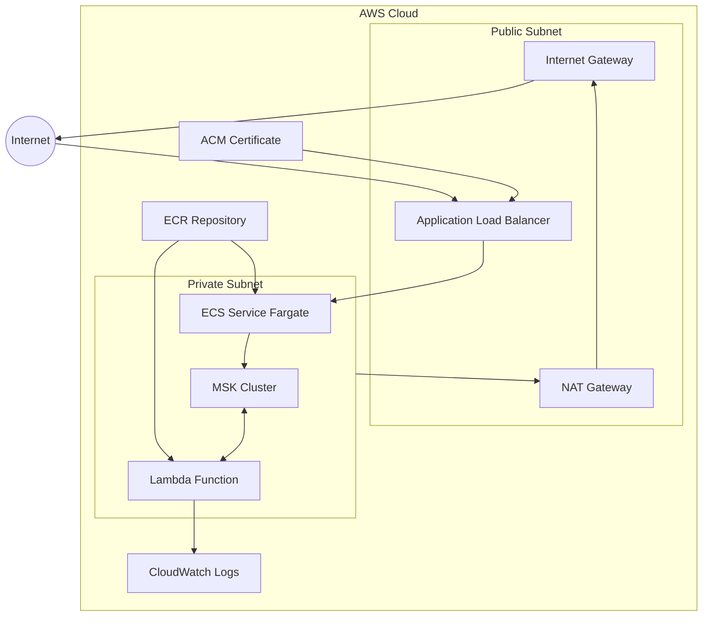

# Infrastructure Architecture

## System Overview

## Component Details

### Modular Infrastructure

**Individual Modules**:
- **vpc/**: VPC, subnets, NAT gateways, routing tables
- **alb/**: Load balancer, target groups, SSL certificates, security groups
- **ecr/**: Container registry with lifecycle policies
- **ecs/**: Fargate cluster, services, task definitions, IAM roles
- **msk/**: Kafka cluster, configuration, security groups
- **lambda/**: Event processor function, MSK triggers, VPC integration

**Environment Separation**:
- **Production**: High-availability configuration in `infrastructure/environments/prod/`

### Network Layer (VPC Module)
- **VPC**: Isolated network environment across 3 availability zones
- **Public Subnet**: Contains ALB and NAT Gateway for internet-facing resources
- **Private Subnets**: Host ECS tasks, MSK brokers, and Lambda functions
- **Internet Gateway**: Provides internet access to public subnet
- **NAT Gateway**: Enables outbound internet access for private resources

### Compute Layer (ECS + Lambda Modules)
- **Application Load Balancer**: Routes HTTPS traffic to ECS services with health checks
- **ECS Fargate Cluster**: Runs containerized API service with auto-scaling
- **Lambda Function**: Processes events from MSK with automatic scaling

### Data Processing (MSK Module)
- **MSK Kafka Cluster**: Multi-broker cluster across availability zones
- **Event Flow**: API → Kafka Topic "events" → Lambda Processing
- **Security**: Encryption at rest and in transit, VPC isolation

### Security (Integrated Across Modules)
- **ACM Certificate**: Automatically provisions and validates SSL/TLS certificates using DNS validation through Route53 (ALB module)
- **Security Groups**: Control network access between components (per module)
- **IAM Roles**: Manage service permissions (ECS and Lambda modules)
- **Encryption**: MSK data encryption and TLS communication

### Monitoring (CloudWatch Integration)
- **CloudWatch Logs**: Centralized logging for all services
- **Health Checks**: ALB monitors ECS service health
- **Module-specific Monitoring**: Each module configures its own logging

### Module Dependencies

1. **VPC Module**: Foundation for all other modules
2. **ECR Module**: Independent, provides container registry
3. **ALB Module**: Depends on VPC, provides load balancing
4. **ECS Module**: Depends on VPC, ALB, ECR for complete service
5. **MSK Module**: Depends on VPC, provides event streaming
6. **Lambda Module**: Depends on VPC, MSK for event processing
